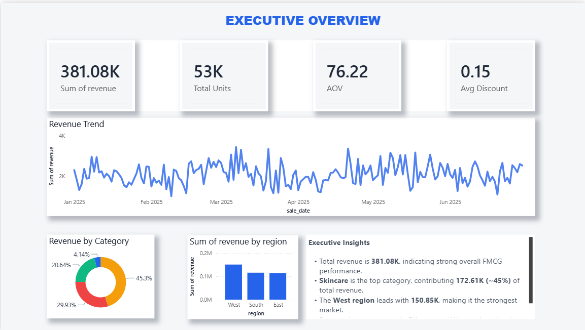
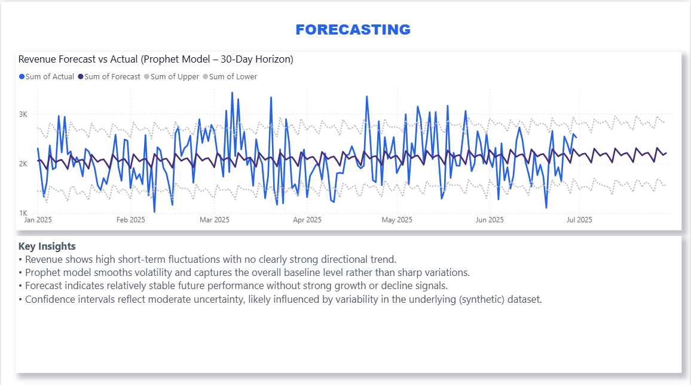

# 📊 FMCG Sales Analytics & Revenue Forecasting Dashboard

## Overview

This project is an end-to-end Business Intelligence and Data Analytics solution that analyzes FMCG (Fast-Moving Consumer Goods) sales performance and forecasts future revenue trends. The project combines SQL for data analysis, Python for time-series forecasting, and Power BI for interactive dashboarding to deliver actionable business insights.

The solution helps stakeholders monitor sales performance, identify top-performing products and stores, understand category and regional trends, and anticipate future revenue using machine learning-based forecasting.

---

## Business Problem

FMCG companies generate large volumes of transactional sales data across products, stores, and regions. Without a centralized analytics solution, it is difficult to:

* Track overall business performance
* Identify high-performing products and stores
* Understand category and regional revenue contributions
* Forecast future demand and revenue trends
* Support data-driven decision-making

This project addresses these challenges through a comprehensive analytics and forecasting dashboard.

---

## Project Objectives

* Analyze sales performance across products, categories, stores, and regions
* Create executive-level KPIs for business monitoring
* Identify top revenue-generating products and stores
* Visualize sales trends and business drivers
* Build a time-series forecasting model for future revenue prediction
* Deliver an interactive Power BI dashboard for stakeholders

---

## Tech Stack

### Data Storage & Querying

* PostgreSQL
* SQL

### Data Processing & Forecasting

* Python
* Pandas
* NumPy
* Prophet

### Visualization

* Power BI

### Version Control

* Git
* GitHub

---

## Project Architecture

Raw Sales Data → PostgreSQL → SQL Analysis → Python Forecasting → Power BI Dashboard → Business Insights

---

## Dashboard Pages

### 1. Executive Overview

The Executive Overview page provides a high-level snapshot of overall business performance.

#### KPIs

* Total Revenue
* Total Units Sold
* Average Discount

#### Visualizations

* Revenue Trend Over Time
* Revenue by Category
* Revenue by Region

#### Key Insights

* Total revenue exceeded 381K.
* Skincare is the leading category, contributing approximately 45% of total revenue.
* The West region generated the highest revenue among all regions.
* Revenue performance is concentrated around a few key business drivers.

---

### 2. Product & Store Analytics

This page focuses on product-level and store-level performance analysis.

#### Visualizations

* Top Products by Revenue
* Store Performance Ranking
* Product Revenue Analysis
* Category Distribution Analysis

#### Key Insights

* Revenue is driven by a small set of top products with a long tail of steady SKUs.
* Store performance is uneven, with a few locations leading sales.
* Volume doesn’t always match revenue, indicating pricing and margin differences.
* Skincare and Shampoo are the key revenue-driving categories.

---

### 3. Forecasting & Insights

This page showcases machine learning-based revenue forecasting using Prophet.

#### Visualizations

* Actual Revenue vs Forecast Revenue
* 30-Day Revenue Forecast
* Forecast Confidence Bounds

#### Model Metrics

* MAE ≈ 393
* RMSE ≈ 493

#### Key Insights

* Revenue shows high short-term fluctuations with no clearly strong directional trend.
* Prophet model smooths volatility and captures the overall baseline level rather than sharp variations.
* Forecast indicates relatively stable future performance without strong growth or decline signals.
* Confidence intervals reflect moderate uncertainty, likely influenced by variability in the underlying (synthetic) dataset.

---

## Forecasting Methodology

The forecasting component uses Meta Prophet, a time-series forecasting library designed for business forecasting tasks.

### Workflow

1. Aggregate transactional sales data into daily revenue.
2. Prepare data in Prophet format:

   * ds = date
   * y = daily revenue
3. Train Prophet model.
4. Generate future predictions for the next 30 days.
5. Evaluate model performance using:

   * Mean Absolute Error (MAE)
   * Root Mean Squared Error (RMSE)
6. Visualize actual vs forecasted revenue in Power BI.

---

## Key Business Findings

### Revenue Performance

* Total revenue reached over 381K.
* Revenue demonstrates consistent demand across the analyzed period.

### Category Performance

* Skincare is the strongest revenue contributor.

### Regional Performance

* The West region is the highest-performing market.
* Regional revenue distribution indicates clear geographic demand differences.

### Forecasting

* Revenue is expected to remain stable in the near term.

---

## Repository Structure

```text
fmcg-sales-analytics-forecasting/
│
├── dashboard/
│   └── PowerBIDashboard.pbix
|
├── data/
│   ├── raw/
│   └── processed/
│
│
├── images/
│   ├── page1_overview.png
│   ├── page2_analytics.png
│   └── page3_forecast.png
|
|
├── notebooks/
│   └── 02_preprocessing.ipynb
│
├── src/
│   ├── queries.sql
│   └── schema.sql
│
├── src/
│   └── generate_data.py
│
├── requirements.txt
├── .gitignore
└── README.md
```

---

## Dashboard Screenshots

### Executive Overview


---

### Product & Store Analytics



---

### Forecasting Dashboard



---

## Skills Demonstrated

### SQL

* Data extraction
* Aggregations
* Revenue analysis
* Window functions
* KPI calculations

### Python

* Data cleaning
* Time-series preparation
* Forecasting with Prophet
* Model evaluation

### Power BI

* Dashboard design
* KPI development
* Data storytelling
* Interactive visual analytics

### Business Analytics

* Revenue analysis
* Product performance evaluation
* Regional sales analysis
* Forecast interpretation

---

## Future Enhancements

* Automated ETL pipeline
* Incremental data refresh
* Advanced forecasting models (XGBoost, LSTM)
* Real-time dashboard integration
* Customer segmentation analysis
* Inventory optimization forecasting

---

## Author

**J J**

MSc Data Science Student
University of Koblenz

### Areas of Interest

* Data Analytics
* Data Engineering
* Business Intelligence
* Machine Learning
* Forecasting & Predictive Analytics

---

## Project Outcome

This project demonstrates the complete analytics lifecycle:

* Data Extraction (SQL)
* Data Preparation (Python)
* Forecasting (Prophet)
* Business Intelligence (Power BI)
* Insight Generation (Business Analytics)

The result is a professional analytics solution capable of supporting business monitoring, performance evaluation, and revenue forecasting for FMCG organizations.

